# NASA HW1

Author: B09902011 陳可邦

## NA

#### 野生的密碼難道會在網路上赤裸地奔馳著？

1. We can simply filter by http and get this, since http don't do encryption:

   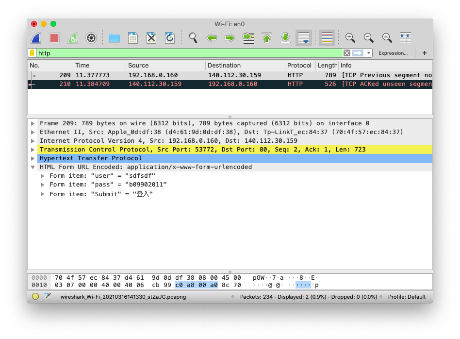

2. This version uses https, which encrypts requests & responses, so we can't get our password from Wireshark.

   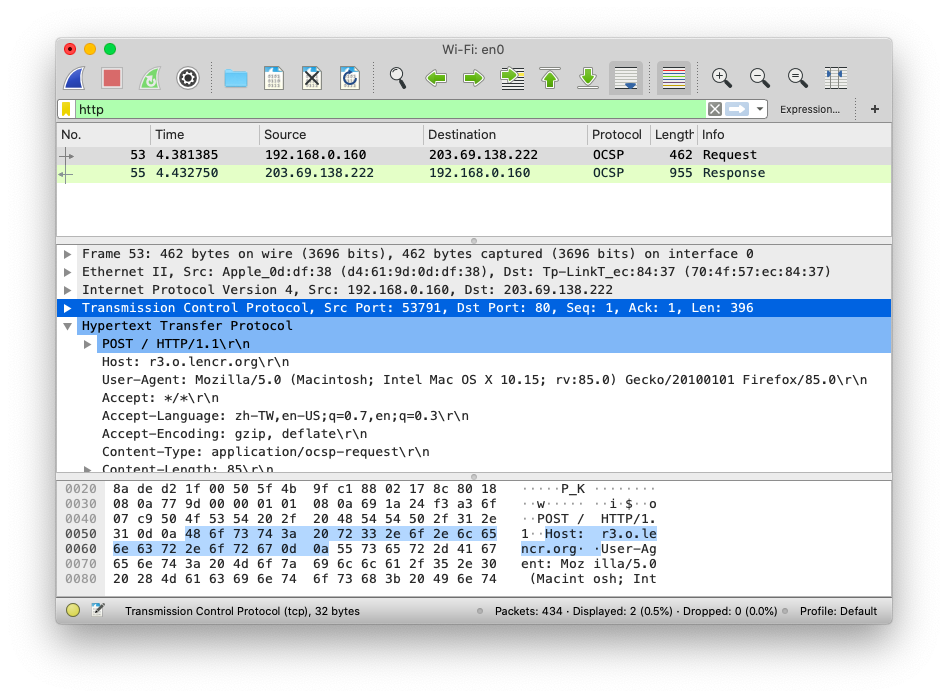

#### 好玩遊戲也有暗潮洶湧的一面

1. We can use the "Conversations > Follow Stream" to inspect these conversations:

   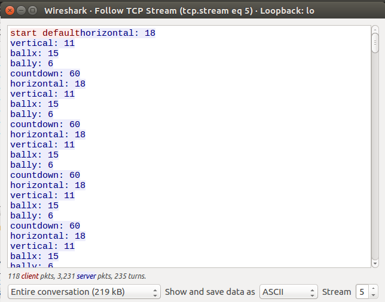

   We can also view only data sent by our side:

   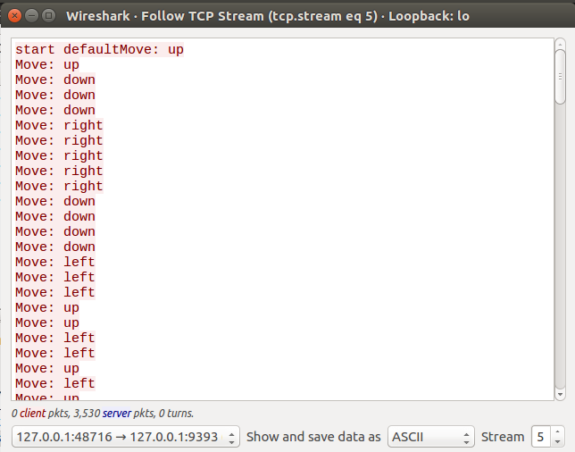

   So basically, the game server sent us the time, the ball and the pad's location, and the client send directions when we press move.

2. If we pay attention to the conversations page, we can notice at some point there's another conversation happening on port 9394:

   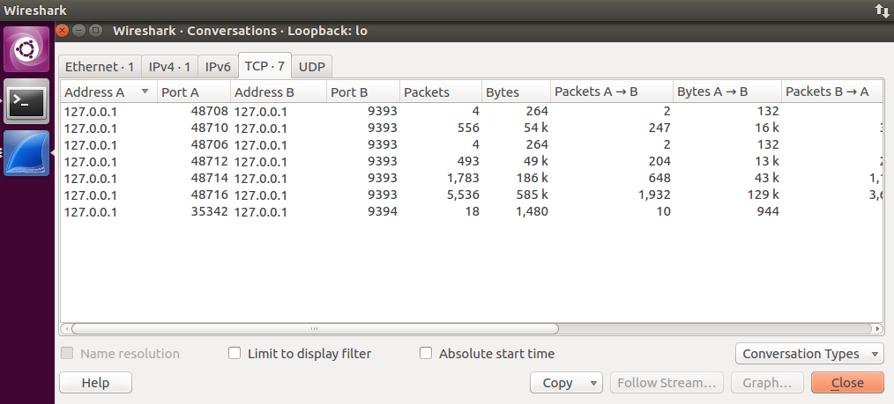

   And when we look into it we'll discover this:

   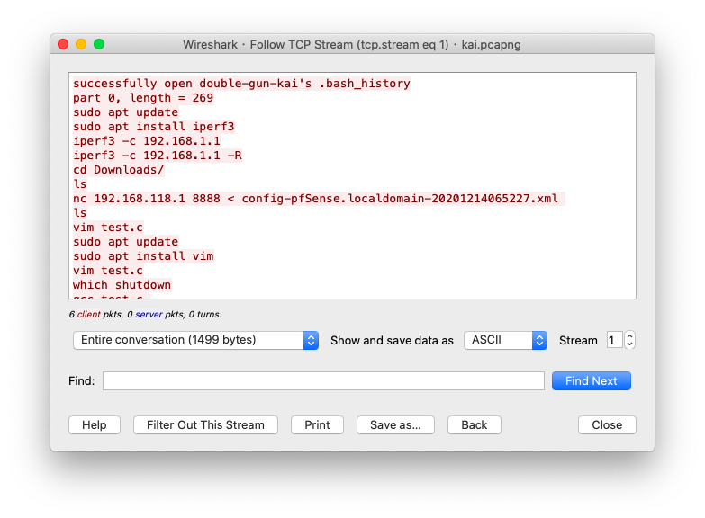

   So we know the game steals our .bash_history.

3. We repeat the above steps with the pcap:

   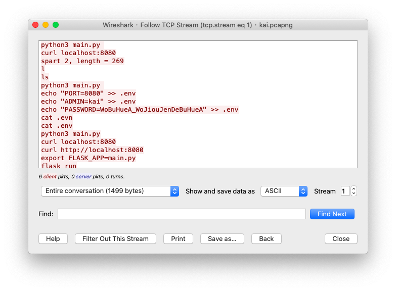

   `PASSWORD=WoBuHueA_WoJiouJenDeBuHueA`

4. I wrote a quick python program to communicate with the server, since we already know the port and the format:

   ```python
   import socket
   host = '127.0.0.1'
   port = 9393
   
   with socket.socket(socket.AF_INET,socket.SOCK_STREAM) as s:
     s.connect((host,port))
     print('connected')
     s.sendall(b'start fast')
     while True:
       data = s.recv(1024).decode('ascii')
       if 'hori' not in data:
         # Stop when recieving anything not game data
         print(data)
         break
       else:
         data=data.split('\n')
         # Make sure it don't explode when server asks for secret
         plus = 0
         if 'secret' in data[0]:
           plus = 1
           
         x=int(data[0+plus].split(' ')[-1])
         y=int(data[1+plus].split(' ')[-1])
         bx=int(data[2+plus].split(' ')[-1])
         by=int(data[3+plus].split(' ')[-1])
         t=int(data[4+plus].split(' ')[-1])
   		
         if x<bx: s.sendall(b'Move: right');print('r')
         elif x>bx: s.sendall(b'Move: left');print('l')
         elif y>by: s.sendall(b'Move: up');print('u')
         elif y<by: s.sendall(b'Move: down');print('d')
   ```

   Got the flag: `HW1{d0_y0u_knovv_wH0_KaienLin_1s?}`

   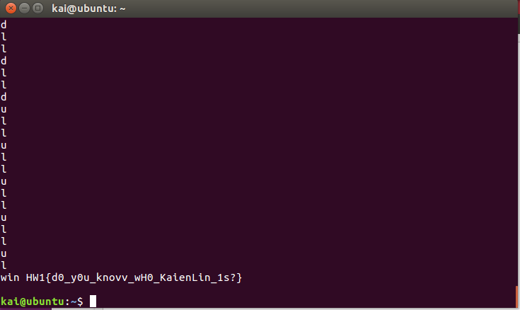

5. I'm too lazy to modify the program to play with 2 balls... Using `netstat -tulpn` we can find the server running on port 9393, then copy it. We already know the flag format, so...

   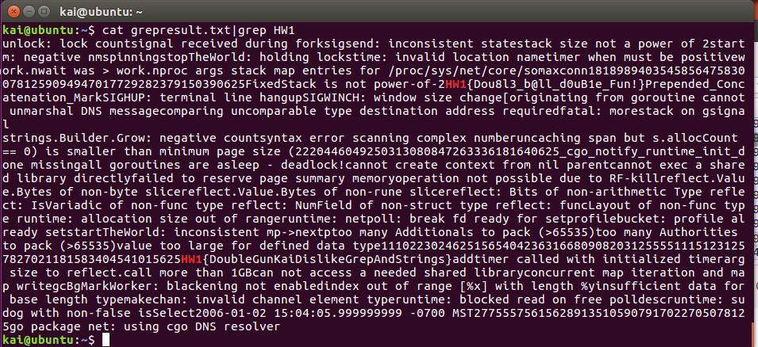

   I'm sorry QAQ Flag: `HW1{Dou8l3_b@ll_d0uB1e_Fun!}`

#### 這麼多的網路協定要是能全部都認識的話該有多好

1. 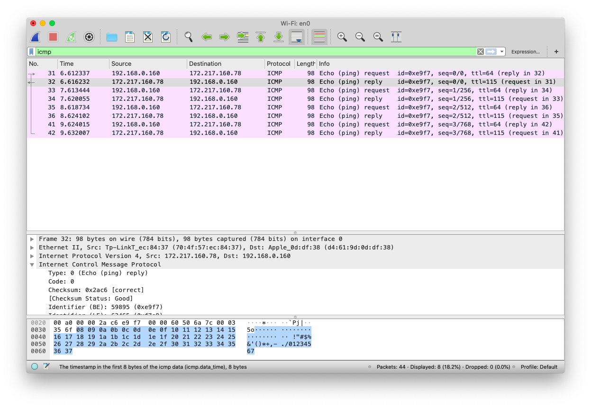

   ICMP, or the Internet Control Message Protocol is used to send error messages and other informations, for figuring out networking issues. It is built on the Network Layer.

2.  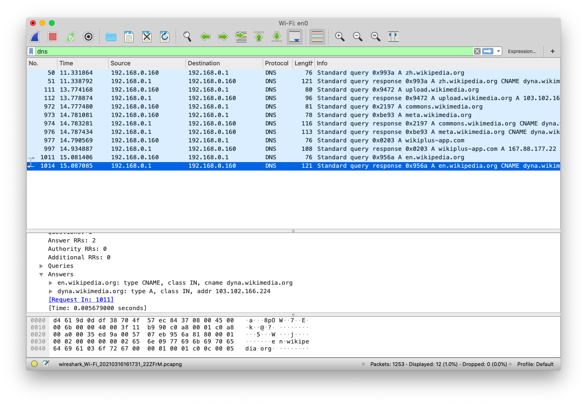

   DNS protocol is used to communicate with DNS servers, and figure out a domain's IP address. It is built on the Application Layer.

3. 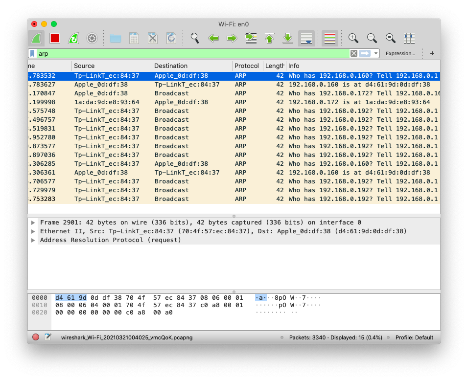 

   The ARP protocol, or the Address Resolution Protocol, is used to in a local network to communicate MAC addresses. It is built on the Data Link Layer.

4.  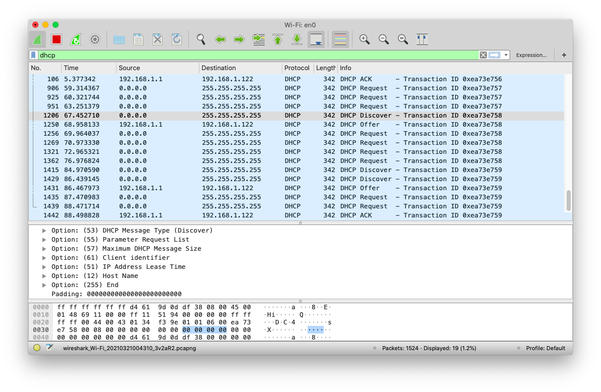

   DHCP protocol, or Dynaic Host Configuration Protocol, is used to communicate with DHCP servers when connecting to it. It handles the process of getting an IP address inside a network.