# NASA HW2

Author: B09902011 陳可邦

## NA

### Short Answer

1. In CSMA/CD & CSMA/CA, CD stands for collision detection, CA stands for collistion avoidance. CSMA/CD monitors for collision during transmission, and terminate as soon as a collision is detected, while CSMA/CA determines if others are transmitting or not beforehand.

   CSMA/CD is not possible for wireless networks, due to wireless transmitters typically can not sense for collisions while transmitting.

   > https://en.wikipedia.org/wiki/Carrier-sense_multiple_access_with_collision_detection
   >
   > https://en.wikipedia.org/wiki/Carrier-sense_multiple_access_with_collision_avoidance

2. Collision domain is where transmissions from multiple devices can collide with one another, broadcast domain is a range of devices where every device can reach each other with a broadcast message.

   (a) Hubs can not split collision domain nor broadcast domain, since all it does is just forwarding all input signals to all connected devices.

   (b) Switches can split collision domain, since it can actually choose which device to send packets to, thus every port is in a different collision domain. However, it can not split broadcast domain, since when a switch recives a broadcast message, it still send it to everyone.

   (c) Routers can split both collision and broadcast domain. It connects between local networks and the internet, and only direct the data between them to each other, it never broadcast message to everyone, thus seperates different broadcast and collision domain.

   > https://en.wikipedia.org/wiki/Broadcast_domain
   >
   > https://en.wikipedia.org/wiki/Collision_domain

3. Broadcast storm is when switches in a  LAN are connected with redundant links, which creates a loop, causing broadcast messages loop around and use up most of the bandwidth, making it unable to transport normal traffic.

   The STP solves this problem by cataloguing redundant links on the network, and block some of the redundant links so that the network forms a spanning tree with a selected switch as the root. When one of the links broke, it will re-enable one of the blocked redundant links so the network can continue without problem.

   > http://en.wikipedia.org/wiki/Spanning_Tree_Protocol

### IPerf

* Testing steps

  On one side, use `iperf -s` to listen.

  On the other side, use `iperf -c <ip of the server> -p 5001 -i 5 -t 60` to test every 5 sec for 1 min.

* 204 PC - Workstation

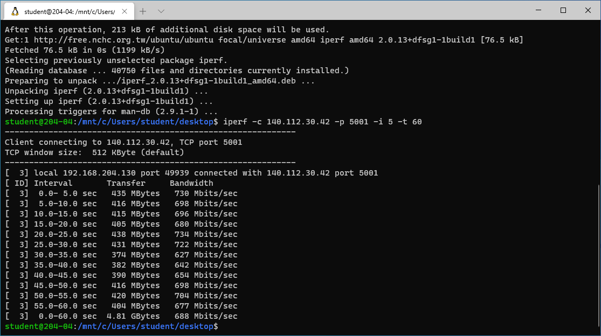

* 204 PC - Wifi device

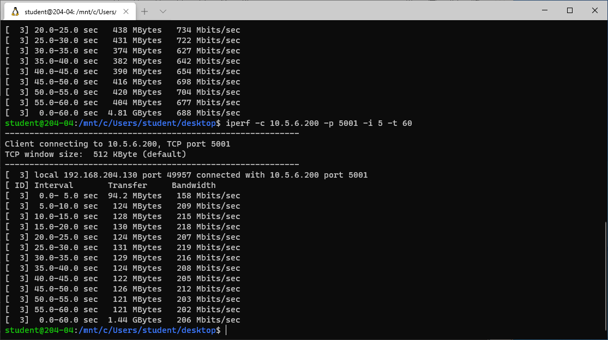

* Wifi device - Wifi device 

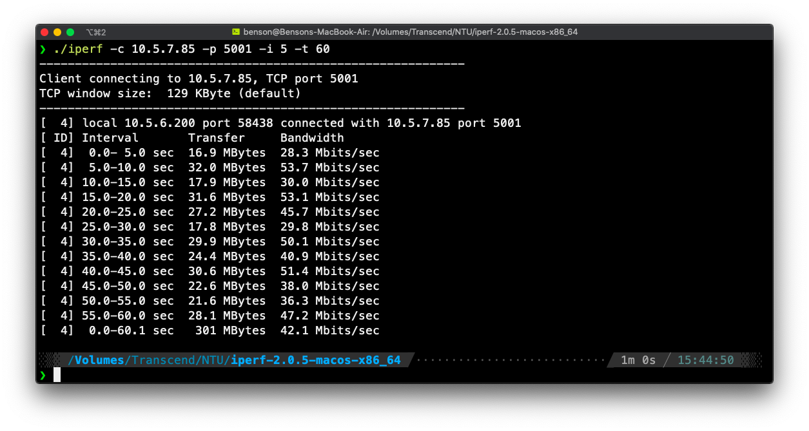

204 - Workstation: It's a wired connection, so naturally it's super fast.

204 (upload) - Wifi device (download): Choke point is wifi download speed.

Wifi device (upload) - Wifi device (download): Choke point is wifi upload speed.

Therefore in terms of bandwidth, (1) > (2) > (3).

### IPv6

On `oasis1.csie.ntu.edu.tw`, we can use `netstat -tupln` to find the server is running at `fe80::5054:ff:fecf:12d9`.

The `fe80` makes it so we must connect from within the network, and specify the network interface.

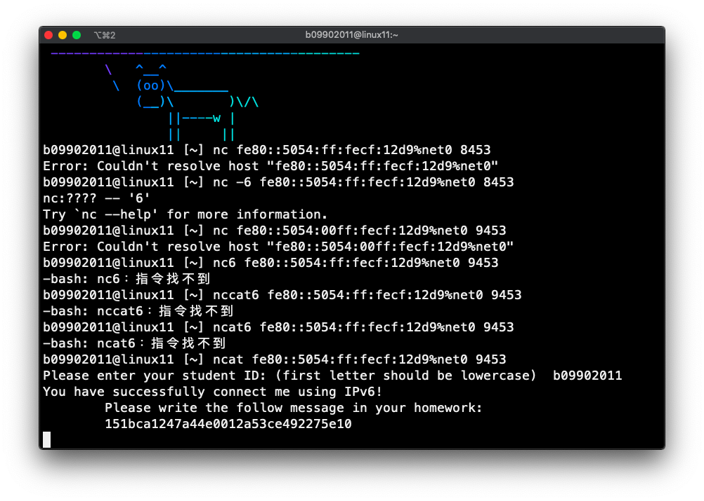

Here you go: ```151bca1247a44e0012a53ce492275e10```

## SA

### 1

```sh
su
umount /dev/sda3
e2fsck -f /dev/sda3
resize2fs /dev/sda3 5G
gdisk: d 3, n 3(+5G), n 4(all), t 0700(microsoft basic data), w
mkfs.exfat /dev/sda4
vim /etc/fstab
# change "UUID=..." to /dev/sda3
# add line "/dev/sda4 /home/nasa/share exfat defaults 0 0"
reboot
```

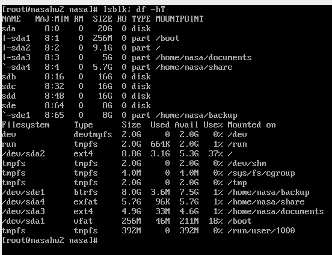

### 2

```sh
su
dd if=/dev/zero of=/myswap bs=1G count=2
mkswap /myswap
swapon /myswap
```

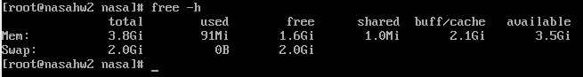

### 3

```sh
su
mkfs.btrfs -d raid1 -m raid1 -f /dev/sdb /dev/sdc
mount /dev/sdb /home/nasa/mnt
```

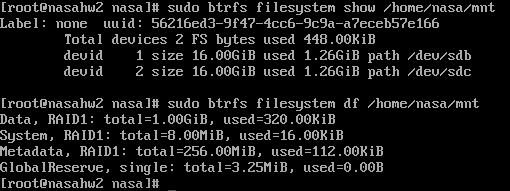

### 4

```sh
su
btrfs subvolume create /home/nasa/mnt/@
btrfs subvolume create /home/nasa/mnt/@videos
btrfs subvolume create /home/nasa/mnt/@documents
mkdir /home/nasa/courses/videos
mkdir /home/nasa/courses/documents
vim /etc/fstab
# add lines:
# /dev/sdb /home/nasa/courses btrfs subvol=@ 0 0
# /dev/sdb /home/nasa/courses/videos btrfs subvol=@videos 0 0
# /dev/sdb /home/nasa/courses/documents btrfs subvol=@documents 0 0
reboot
```

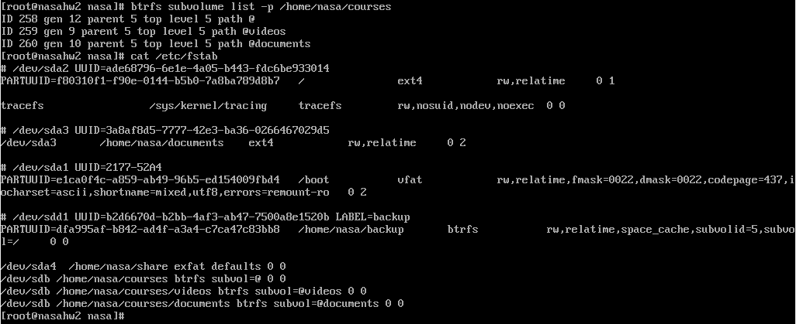

### 5

```sh
su
btrfs subvolume snapshot -r /home/nasa/courses/documents /home/nasa/courses/documents_backup
```

### 6

```sh
su
mv /home/nasa/videos/* /home/nasa/courses/videos
btrfs subvolume snapshot -r /home/nasa/courses/videos /home/nasa/courses/videos_backup
btrfs send /home/nasa/courses/videos_backup | btrfs receive /home/nasa/backup
```

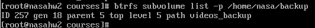

### 7

```sh
su
btrfs add device /dev/sdd /home/nasa/courses
btrfs balance start -dconvert=raid5 -mconvert=raid5 /home/nasa/courses
```

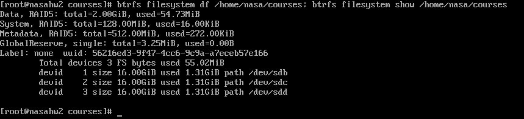

###  8

```sh
sudo btrfs device delete /dev/sdc /home/nasa/courses
btrfs balance start -dconvert=raid1 -mconvert=raid1 /home/nasa/courses
```

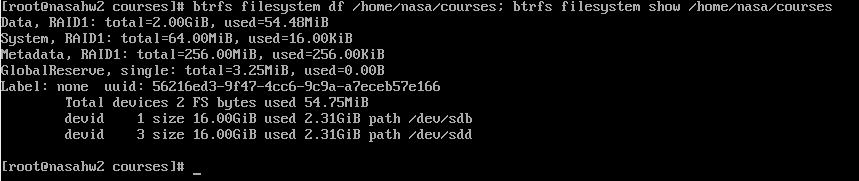

### 9

1. Ext4 v.s btrfs:

|                  | Ext4     | btrfs    |
| :--------------- | :------- | -------- |
| Max. File size   | 16TB     | 16EB     |
| Max. File number | $2^{32}$ | $2^{64}$ |
| Snapshots        | No       | Yes      |
| RAID             | No       | Yes      |

> https://linuxhint.com/btrfs-vs-ext4-filesystems-comparison/

1. RAID

   * RAID 0: Combining multiple drives' space to make a BIIIG drive.
   * RAID 1: Mirror everything on all drives, to get a drive with the size of the smallest among its components.
   * RAID 5: Uses one drive as checksum, and distribute data evenly to all remaining drives. When any one of the drives is broken, its data can be recovered from the rest. Require at least 3 drives.
   * RAID 10: Divide the drives to 2 groups, use RAID 1 to make each group into a drive, then make these 2 drives as a RAID 0 drive.

   > https://en.wikipedia.org/wiki/RAID

2. FUSE

   FUSE, or filesystem in userspace, is a framework allowing non-privileged users to mount and create their own filesystem. This is very helpful, however its somewhat slower, and has to be loaded from somewhere else to boot.

   > https://unix.stackexchange.com/questions/4146/what-are-the-benefits-and-downsides-to-use-fusefs-filesystems

4. ZFS & Hardware RAID

   ZFS is a 128 bit filesystem with integrated software RAID features, with supports for many unix-like OSes. Hardware RAID uses extra hardware to assist various RAID operations, which makes it faster and also won't take up CPU rescourses.

   Personally I would choose ZFS, just because it's more modern and hardware RAID is just too expensive.

   > https://en.wikipedia.org/wiki/ZFS#Summary

