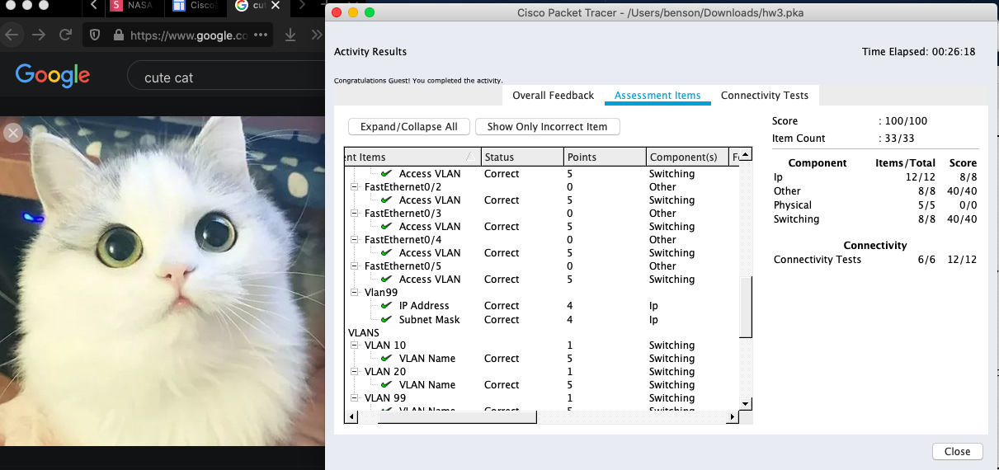

# NASA hw3
Author: B09902011 陳可邦

## NA

### VLAN, access & trunk
1. 
	* Gi/0/3 is an access port, therefore when it receive an untagged packet, it will add VLAN 307 tag on it.
	* Gi/0/4 is a trunk port, therefore it will try to match the VLAN ID of the packet with the Native VLAN ID the port, in this case it matches (VLAN 1), so it would be sent without .1q tag.
	* Gi/0/5 is a trunk port, therefore it will try to match the VLAN ID of the packet with the Native VLAN ID the port, in this case it does not match, so it will add VLAN 307 tag on it.
	
2. Packets sent from host A must have VLAN 424 header, and when Gi/0/1 gets it, the switch will strip the header, and send out the untagged packet from Gi/0/2. 

3. If the admin wants to see what all of these untagged packets are doing, they can use native trunk to point it to an unused VLAN only the admin can see.

> https://www.pcwdld.com/tagged-untagged-and-native-vlans
### More on link aggregation

1. No. IEEE standard requires each link have identical speed, if you try to do link aggregation with two cables with different speed, most device will throw an error.

   > https://en.wikipedia.org/wiki/Link_aggregation

2. channel-group mode in LACP can not all be set to passive, or the port channel can not be set up. To fix this, set any of Gi1/0/1 and Gi1/0/2 to be `channel-group 1 mode active`.

   > Source: 上課簡報

### Malicious User

1. L2 Switches only does switching based on MAC address (Layer 2), while L3 switches can handle IP headers and have routing tables, so it can create subnets in a LAN.

   Routers can connect to WAN, and can support layer 3 features like NAT, firewall, etc. L3 switches can only do things inside a LAN, but is generally faster.

   > https://community.fs.com/blog/layer-2-switch-vs-layer-3-switch-which-one-do-you-need.html
   >
   > http://www.fiber-optic-equipment.com/layer-3-switch-vs-router-choose.html

2. ARP table match an IP to a MAC address, MAC address table match an MAC address to a port on a switch.

   > https://eeepage.info/arp-mac-tale

3. Start at the core switch, use `show arp | include <IP>`  to find which L2 switch it is on, and its MAC address. Then on the edge switch, use `show mac address-table | include <MAC> ` to find which port the target is connected on. 

   > Source: cisco documentations

### Set up another Cisco switch

1. Serial communication means transfering 1 bit at a time continuously, as opposed to transfering multiple bits in parallel.

   > https://en.wikipedia.org/wiki/Serial_communication

2. Pro: It's the only way to connect to a brand new machine

   Con: You can not use them while you're not with the machine

   > https://www.jannet.hk/zh-Hant/post/console-cable/

3. If you have previously configured remote connection methods such as Telnet or SSH, you can use them, else you just simply can't do that.

   > http://www.james-tw.com/cisco/cisco-she-ding-yuan-duan-lian-xian-telnet-ssh

4. Stacking makes multiple switches act like one device with all the port in the stack. This enables you to expand bandwitdth as much as possible, also providing link redundancy, can still work when one of the link brakes.

   2 switches require 2 stack cable to work.

   > https://community.fs.com/blog/switch-stacking-vs-trunking-vs-uplink-which-is-best-to-connect-switches.html

### Cisco Packet Tracer

```sh
enable
conf t
# 1
hostname CiscoLab
# 2
no ip domain-lookup
# 3
enable password CISCO
service password-encryption
# 4, 5, 6
int range fa0/1-2
switchport access vlan 10
int range fa0/3-4
switchport access vlan 20
int fa0/5
switchport access vlan 99
exit

line vty 0 4
password cisco
int vlan 99
ip address 192.168.99.1 255.255.255.0
no shutdown
exit
```



Bonus cat picture because why the hell not

> Source: 上課簡報

## SA

### 1

```
sudo yum install virt-install qemu-kvm libvirt -y
systemctl enable libvirtd
systemctl start libvirtd
```
### 2

#### 1
NAT assigns the guest a subnet, and masks all traffic as if they come from the host.
Bridge network assigns a ip in the same subnet the host is in, outsider can see it along with the host.

> https://superuser.com/questions/227505/what-is-the-difference-between-nat-bridged-host-only-networking

#### 2

1. Edit /etc/sysconfig/network-scripts/ifcfg-eth0
    * comment out `BOOTPROTO`
    * Add `BRIDGE=br0`
2. Create /etc/sysconfig/network-scripts/ifcfg-br0
    * Add:
    ```
    DEVICE=br0
    BOOTPROTO=dhcp
    ONBOOT=yes
    TYPE=Bridge
    ```
3. `/etc/init.d/network restart`
> https://www.linux-kvm.org/page/Networking#Public_Bridge

### 3
1. `mkdir -p /data/img`

2. `qemu-img create -f qcow2 /data/img/img.qcow2 10G`

3. Add to kickstart:

```sh
# Add before Anything with %
user --name="xiaoming" --password="XMishandsome" --groups=wheel
# Add at bottom
%post
#!/bin/sh
yum install epel-release sudo vim wget -y
%end
```

4. Run:

```sh
virt-install \
--name ILoveNASA \
--ram 2048 \
--vcpus=2 \
--nographics \
--network bridge=br0 \
--disk path=/data/img/img.qcow2,format=qcow2 \
--location http://centos.cs.nctu.edu.tw/7/os/x86_64/ \
--initrd-inject=/root/nasa.ks \
--extra-args="ks=file:/nasa.ks console=tty0 console=ttyS0 console=ttyS0,115200 serial"
```

> https://docs.centos.org/en-US/centos/install-guide/Kickstart2/
>
> https://www.cyberciti.biz/faq/kvm-install-centos-redhat-using-kickstart-ks-cfg/

### 4

1. `yum install openssh-clients openssh-server`
  `systemctl enable sshd.service`
  `systemctl start sshd.service`

  >  https://www.cyberciti.biz/faq/centos-stop-start-restart-sshd-command/

2. 

3. Press Ctrl+]

4. 

5. 

### 5
1. `virsh suspend ILoveNASA`
2. `virt-clone --original ILoveNASA --name ILoveNASA-2 --autoclone`
3. `virsh resume ILoveNASA`
4. 
5. `virsh setvcpus ILoveNASA-2 1 --config`
6. 

> https://www.cyberciti.biz/faq/how-to-clone-existing-kvm-virtual-machine-images-on-linux/