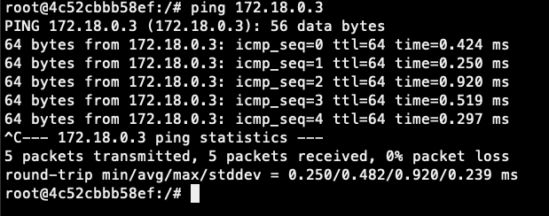

# NASA HW4

B09902011 陳可邦

## NA

### Short answers

1. "Block" just drops the packet and doesn't give the sender any response, while "Reject" tells the sender that the packet is dropped. 

   > Source: Lab 4 Slides

2. "Interface net" matches anything in the subnet, while "interface address" only matches the 1 address assigned to said net.

   > https://www.reddit.com/r/PFSENSE/comments/6vyqw3/what_is_the_difference_between_the_interface_net/

3. pfSense is a stateful firewall, which means it stores information about connections flowing through, so the reply traffic will be allowed automatically.

   > https://docs.netgate.com/pfsense/en/latest/firewall/fundamentals.html#firewall-stateful

### pfSense

1. "Interfaces > VLAN": Add VLAN 5 & 99, assign subnets,  "Interfaces > Interface assignment" > Add the VLANs, "Service > DHCP": Enable and add DNS for two vlans.

2. "Firewall > Alias", Add the values.

3. "System > Advanced", enable SSH.

4. Add rules:

   

5. Add rules: WAN Block source !vlan99, dest vlan99. LAN Block source !vlan99, dest vlan99. VLan5 Block source !vlan99, dest vlan99.
6. Add Schedule at 2021/5/11, then add rules: 
7. See rules in 6.

## SA

### About Container

#### 1

When to use container:

1. When you want to have a fixed environment so you can eliminate environment factors when collaborating.
2. When you want to quickly test your app in different environments, but don't want to set up a lot of VMs and waste time.
3. When you want to test a new tool, but don't want to pollute your system, you can use images built by the developer.
4. When you want a server run multiple application at the same time, but don't want them to interfere with one another, to prevent problems.

When to use VM:

1. When you really need security, because docker containers are not the most secure.
2. When your application is complicated, and using docker just isn't enough.
3. When you need multiple OSes, since docker use your host computer's OS, you'll need VM if you want to test your app on other OSes.

> https://www.linode.com/docs/guides/when-and-why-to-use-docker/

#### 2

* OCI (Open Container Initiative) is a organization whose purpose is to create an industry standard for containers runtime, currently it specificities runtime and image format. CRI (Container Runtime Interface) is an API for Kubernetes to communicate with various container runtimes.
* Docker's runtime & image supports the OCI Specs. CRI can be used to manipulate containers made by Docker.

> https://www.tutorialworks.com/difference-docker-containerd-runc-crio-oci/

### Docker Basics

1. `docker rm $(docker ps -aq)`

2. `docker rmi -f $(docker images -a -q)`

3. `docker system prune -a`

4. `docker inspect -f '{{range .NetworkSettings.Networks}}{{.IPAddress}}{{end}}'  5b0f1ed0dcb8`

5. `docker stats -a --format "table {{.Container}}\t{{.CPUPerc}}\t{{.MemUsage}}"`

6. `docker pull nginx:1.19.2`

   `docker run -d -p 5678:80 --name nginx-1 nginx:1.19.2`

   

7. `docker exec -it nginx-1 /bin/sh`

   exec: executes a command in the container, in this case "/bin/sh".

   -it: keeps stdin open for input, and makes the output behave as expected.

   

8. `docker exec nginx-1 cat /etc/nginx/nginx.conf`

   exec: executes a command in the container, in this case "cat /etc/nginx/nginx.conf"

   

   > 上課簡報 & stackoverflow

### Docker Network

#### 1

1. Bridge mode: The container gets a IP assigned in a subnet by the host, similar to NAT. This is the default mode for Docker.
2. Host mode: Use the same network settings as the host, can change the network settings of the host from the container. Used when you don't want any networking difference between the host and the container.
3. None: No network. Used when your container don't need internet connection.
4. Container mode: Use the same network settings as some other container of your choice. Used when you want multiple containers behave the same in networking.

> https://docs.docker.com/network/

#### 2

Creating the network: `docker network create nasa-net`

Run nginx-2: `docker run -d -p 6969:80 --name nginx-2 nginx:1.19.2`

Connect nginx-1 to the net: `docker network connect nasa-net nginx-1`

Connect nginx-2 to the net:`docker network connect nasa-net nginx-2`

`docker inspect -f '{{range .NetworkSettings.Networks}}{{.IPAddress}}{{end}}' nginx1 nginx2`: 

Ping from nginx-1 to 2: 

Ping from nginx-2 to 1:

 

> https://docs.docker.com/network/

#### 3

To find the host IP from within the container, `ping docker.host.internal` and look for the IP. The question didn't specify if we want to find the IP from within the container or the outside so I don't know what we're trying to achieve here.

> https://stackoverflow.com/questions/22944631/how-to-get-the-ip-address-of-the-docker-host-from-inside-a-docker-container

### Build Application

1. * When appending some commands after a `docker run` command, the commands using `CMD` will be overrides, `ENTRYPOINT` will not.

   * `ENTRYPOINT` will only be overrided by using `--overide` option.

   * Their name is different.

   ```dockerfile
   FROM ubuntu
   ENTRYPOINT ["echo"]
   CMD ["Hello"]
   ```

   If we run `docker run test`, it will echo `Hello` . If we run `docker run test meow`, it will echo `meow`.

   > https://ithelp.ithome.com.tw/articles/10250988

2.  Docker-compose is a tool for running a multi-container Docker applications. Docker-compose uses a YAML file to configure a application, while Docker use Dockerfile to run a single container.

   > https://docs.docker.com/compose/

3. `-p`: maps a port of the host to a port of the container.

   `-w`: set working directory

   `-v ${PWD}:/app`: Put current directory to `/app` inside the container.

   `--network nasa-net`: use nasa-net as network

   `-e`: set environment variables

   ```yaml
   version: "3.8"
   services:
     app:
       image: node:12-alpine
       command: sh -c "echo helloworld"
       ports:
         - 3000:3000
       working_dir: /app
       volumes:
         - ./:/app
       environment:
         MYSQL_HOST: mysql
         MYSQL_USER: root
         MYSQL_PASSWORD: secret
     mysql:
     	image: mysql:5.7
     	volumes: 
     		- ./mysql-data:/var/lib/mysql
     	environment:
     		MYSQL_ROOT_PASSWORD: secret
   networks:
     default:
     	external:
     		name: nasa-net
   ```

   

4. (a) `docker-compose up -d`

   (b) `docker-compose pause $(docker-compose ps --services)`

   (c) `docker-compose down -v`

### Docker in Docker

1. Dockerfile:

   ```dockerfile
   FROM ubuntu:18.04
   RUN apt-get update
   RUN apt-get -y install apt-transport-https ca-certificates curl gnupg lsb-release
   RUN curl -fsSL https://download.docker.com/linux/ubuntu/gpg | gpg --dearmor -o /usr/share/keyrings/docker-archive-keyring.gpg
   RUN echo "deb [arch=amd64 signed-by=/usr/share/keyrings/docker-archive-keyring.gpg] https://download.docker.com/linux/ubuntu $(lsb_release -cs) stable" | tee /etc/apt/sources.list.d/docker.list > /dev/null
   RUN apt-get update
   RUN apt-get -y install docker-ce docker-ce-cli containerd.io
   
   RUN usermod -aG docker $(whoami)
   RUN newgrp docker
   RUN touch dk.sh; echo "service docker start" >> dk.sh; echo "docker run hello-world" >> dk.sh; echo "/bin/bash" >> dk.sh
   RUN chmod +x dk.sh;
   CMD ["/bin/sh", "dk.sh"]
   ```

2. `docker build -t dind-nasa-hw4:v1.0.0 .`  `-t` for the image name and tag, `.` is the directory.

3. `docker run --cap-add=NET_ADMIN --privileged dind-nasa-hw4:v1.0.0` 

   `--privileged` needed to start docker daemon, `--cap-add=NET_ADMIN` needed to pull hello-world for some reason.


> https://stackoverflow.com/questions/45731683/docker-pull-operation-not-permitted

4. `docker tag dind-nasa-hw4:v1.0.0 chenkb/dind-nasa-hw4:v1.0.0`

   `docker login`

   `docker push chenkb/dind-nasa-hw4:v1.0.0`

   