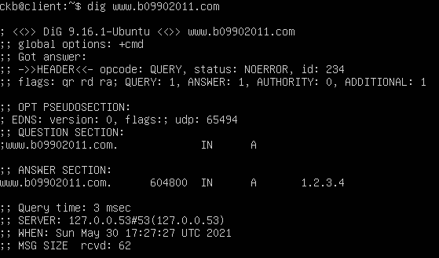
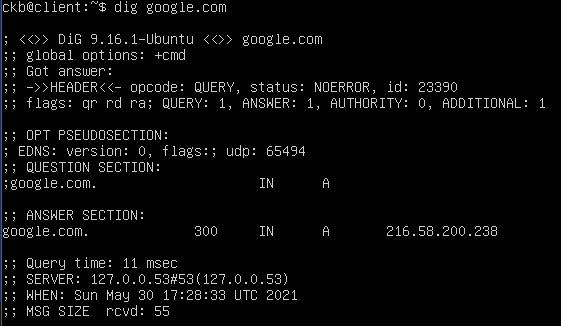
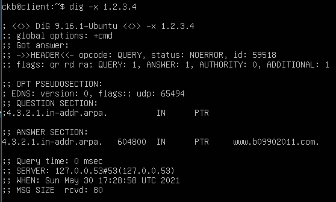

# NASA HW6

Author: B09902011陳可邦

## Network Administration

### DNS & DHCP

* 設定網卡

  1. 在VMware的設定給Server一個NAT網卡，及一個接到LAN segment的網卡。

  2. 使用Ubuntu Server的iso開機，全部選預設選項安裝，設定user & password並重新啟動

  3. 等待重新啟動後登入，`sudo vim`編輯`/etc/netplan/`裡頭的檔案:

     ```yaml
     ens34:
        addresses: ["192.168.5.254/24"]  # replace the dhcp line
     ```

     然後`sudo netplan generate && sudo netplan apply`

* DHCP

  1. `sudo apt-get install isc-dhcp-server`

  2. `sudo vim /etc/dhcp/dhcpd.conf`

     ```
     option domain-name "nasa";
     default-lease-time 600;
     max-lease-time 7200;
     ddns-update-style none;
     INTERFACES="ens34";
     authoritative;
     subnet 192.168.5.0 netmask 255.255.255.0{
     	range 192.168.5.100 192.168.5.200;
     	option routers 192.168.5.254;
     	option domain-name-servers 192.168.5.254;
     }
     ```

  3. `sudo systemctl start isc-dhcp-server.service`

* DNS

  1. `sudo apt-get install bind9`

  2. 編輯/etc/bind中的檔案：

     * named.conf.local:

       ```
       zone "b09902011.com" {
               type master;
               file "/etc/bind/nasa.hosts";
       };
       
       zone "3.2.1.in-addr.arpa" {
               type master;
               file "/etc/bind/nasa.hosts2";
       };
       ```
     
     * nasa.hosts:
     
       ```
       $TTL    604800
       @       IN      SOA     b09902011.com. root.b09902011.com. (
                         3       ; Serial
                    604800     ; Refresh
                     86400     ; Retry
                   2419200     ; Expire
                    604800 )   ; Negative Cache TTL
       ; name servers - NS records
            IN      NS      b09902011.com.
       ; name servers - A records
       
       www.b09902011.com.       IN      A      1.2.3.4
       b09902011.com.           IN      A      192.168.5.254
       ```
       
     * nasa.hosts2
     
       ```
       $TTL    604800
       @       IN      SOA     b09902011.com. root.b09902011.com. (
                         3       ; Serial
                    604800     ; Refresh
                     86400     ; Retry
                   2419200     ; Expire
                    604800 )   ; Negative Cache TTL
       ; name servers - NS records
            IN      NS      b09902011.com.
       ; name servers - PTR records
       
       4       IN      PTR     www.b09902011.com.
       ```
     
     * named.conf.options:
     
       ```
       options {
               directory "/var/cache/bind";
               listen-on{ any; };
               recursion yes;
               allow-recursion{
                       localhost;
                       192.168.5.0/24;
               };
       };
       ```
     
  3.  `service bind9 reload`
  
* Client

  VMware設定一個連到同一個LAN segment的網卡，用ubuntu的iso開機。系統會自動從DHCP server拿到IP。

  

  

  

  

> https://magiclen.org/ubuntu-start-job-wait-network/
>
> https://ubuntuqa.com/zh-tw/article/10932.html
>
> Lab簡報

### Short Answer

1. TTL表示Time to live，即一筆DNS紀錄會在DNS快取伺服器保留的時間。DNS propagation time 代表在變更一個DNS紀錄後，要過多少時間才會讓全球都知道這個變動，因此如果快取伺服器的TTL設的越長，在這一段時間內外界的查詢都只會查到舊的紀錄，propagation time 變越長。

   TTL設較長，對DNS cache server的負擔變較輕，因為它就不用在一段時間內查詢太多次。而若你的DNS紀錄需要常常變動，則TTL應設越短越好，如此這些變動才能盡快讓外界能夠得知。

2. DNS server會將所有查詢過的Domain name都cache起來，方便不用每次有人來查詢這個domain name都要再去問一次authoritative server，只有在TTL過了之後才去重新查詢。對authoritative server來說，這大幅降低了它所需要做查詢的次數，降低效能及網路頻寬的需求，相當重要。

3. DNS cache poisoning，即攻擊者透過假裝是authoritative nameserver，透過傳送大量的回應封包，試圖讓查詢對象cache到錯誤的IP。DNS server透過檢查一系列風暴內的資訊來防範這種攻擊，如此攻擊者首先需要知道查詢者DNS封包的ID、查詢內容、UDP port等，並製造對應的封包，這些攻擊封包才有可能被接受，攻擊者很難同時猜對這麼多資訊，於是便難以成功攻擊。

4. 在Kaminsky attack中，攻擊者不針對一筆查詢做攻擊，而是對一整個目標domain做攻擊。

   攻擊者首先建立一個DNS server，並聲稱自己是目標domain (如bigbank.com) 的authoritative server，接著，對受害者nameserver做一筆在目標domain內，但不太可能已經被cache起來的查詢 (如a3a83f.bigbank.com)。等到受害者準備要向真正的目標domain的DNS server (如ns1.bigbank.com) 查詢時，攻擊者開始傳送一系列偽造封包，告訴受害者這個回應是來自 ns1.bigbank.com，IP為 1.2.3.4 (攻擊者控制的IP)，若受害者接受了這個惡意回應，接下來的一段時間內它就會將所有bigbank.com的查詢全部都導向攻擊者。

   由於這筆查詢是攻擊者做的，攻擊者便知道查詢內容，猜測範圍就較小。雖然每一筆隨機查詢讓受害者成功接受的機率還是很小，但攻擊者可以大量隨機生成如 a234f23.bigbank.com 這種查詢，並重複嘗試攻擊，通常便能很快成功攻擊。

   目前透過加長查詢ID以及隨機UDP port的範圍，可能組合變為數千倍，讓Kaminsky攻擊成功的機率大幅降低。而也有如DNSSEC及IPv6可以防範這種攻擊，但是要等到夠普及，發揮夠大的效果，可能還要等幾年。

> http://unixwiz.net/techtips/iguide-kaminsky-dns-vuln.html

## System Administration

### 1. This problem is Not For Sale

1. Mount NFS

   因為我們沒有工作站的root權限，所以只能想辦法繞過去。我們可以利用`qemu`在站上建一個VM，來達到這個邪惡的目的。

   ```sh
   # create virtual disk
   qemu-img create -f qcow2 /tmp2/b09902011/cent.qcow2 10G
   # install centOS 7
   virt-install \
   --name nasaCent \
   --ram 2048 \
   --vcpus=2 \
   --nographics \
   --diskpath=/tmp2/b09902011/cent.qcow2,format=qcow2 \
   --location http://centos.cs.nctu.edu.tw/7/os/x86_64/ \
   --extra-args="console=ttyS0"
   ```

   執行之後用text mode進行安裝，開機登入後`yum install nfs-utils`安裝nfs工具，

   `mount -t nfs 10.217.44.112:/e/NASA_flag /mnt`掛載之後即可拿到flag:

   `NASA{M0un71n6_NF5!2021}`
   
   > Source: 與B09902004郭懷元、B09902100林弘毅討論、上課簡報
   
2. Failing Successfully

   工作站可能有用類似Kerberos的工具，管理那些使用者/IP可以mount那些資料夾，藉此來防止像是我們前面用別台機器mount的這個行為。

   > https://linux.vbird.org/linux_enterprise/kerberos.php

3. Notice my files, senpai

   `touch .nasa-is-an-awesome-course`

   `nfs4_setfacl -a A::69465:RWX .nasa-is-an-awesome-course`

   > https://www.osc.edu/book/export/html/4523

4. RIP=RELEASE

   NFS是檔案分享用的協議，容易設置，並可以隨意擴充檔案數量。iSCSI是一個網路上遠端磁碟區塊的協議，可以在上面建立一整個檔案系統，且使用頻寬的效率較好。

   NFS適合用在日常透過網路存取其他機器上的檔案，而iSCSI是當你需要一整個自訂的磁碟來做如開機等動作的時候使用。

   > https://communities.vmware.com/t5/vSphere-Storage-Discussions/iSCSI-vs-NFS/td-p/2284306

### 2. Getting Your Fix of VMs

 1. Does it boot?

    用virt-manager開機進到grub命令列，嘗試手動開機:

    ```
    set root=(hd0,1)
    set prefix=(hd0,1)/boot/grub
    linux /boot/vmlinuz-linux root=/dev/vda1
    initrd /boot/initramfs-linux.img
    ```

    發現根本進不到系統，所以重新來過，並加入`init`參數來拿到shell:

    ```
    linux /boot/vmlinuz-linux root=/dev/vda1 init=/bin/sh
    initrd /boot/initramfs-linux.img
    ```

    拿到shell之後:

    ```shell
    mount -o remount,rw /   # 讓你可以讀寫
    history
    # 看history，很明顯可以看到應該是新的那個image沒辦法mount造成的問題
    vi /etc/fstab
    # 把有問題的那一行刪掉
    ```

    接下來要讓grub有正確的device資訊:

    ```shell
    grub-mkconfig -o /boot/grub/grub.cfg
    reboot
    ```

    > https://blog.wu-boy.com/2008/05/linux筆記-利用-mount-指令解決-read-only-file-system-問題
    > https://www.linux.com/training-tutorials/how-rescue-non-booting-grub-2-linux/

2. 1. Vanilla

   使用virt-manager直接開機開不了，可以抓一個arch的live iso來協助。

   在用live iso開機之後`mount /dev/md0 /mnt`發現掛載不了，要先把它重新assemble:

   ```sh
   cd /dev
   mdadm --stop md0
   echo 2 > /sys/module/raid0/parameters/default_layout
   mdadm --assemble md0 vda5 nasa/root
   ```

   > https://serverfault.com/questions/834886/how-to-recover-raid-mount-cant-read-superblock/834920
   > https://www.reddit.com/r/linuxquestions/comments/debx7w/mdadm_raid0_default_layout/

   接著，查詢arch wiki可知若要在RAID及LVM安裝archlinux，需要有一些特別的步驟，所以也要處理才能開機:

   1. 首先要先讓`mdadm`知道有那些RAID的東西要組:

      ```sh
      mount md0 /mnt
      mdadm --detail --scan >> /mnt/etc/mdadm.conf
      ```

    2. `arch-chroot`，要讓系統的grub知道有那些東西要載入，並生成開機時的ramfs:

       ```sh
       pacman -S vim
       vim /etc/mkinitcpio.conf
       # 編輯:
       # MODULES=(dm-raid raid0 raid1 raid10 raid456)
       # HOOKS=( ... lvm2 mdadm_udev ... )
       ## HOOKS 的順序很重要，lvm2要在mdadm_udev前面
       mkinitcpio -P
       vim /boot/grub/grub.cfg
       # 編輯:
       # linux .... root=/dev/md0 ... raid0.default_layout=2
       ```

       

2. 2.  Raid, Shadow legends

   上一題做完之後，`mdadm /dev/md1 -a /dev/vda7`，就修好了

   > https://serverfault.com/821966/how-to-re-add-a-drive-when-raid-is-in-degraded-mode

### 3. PAC-Man 2024

如`pacman`的arch wiki所述，`pacman`不支持所謂的「部分更新」，即只用`-y`而不用`-u`。如此做可能造成pacman在安裝時同時更新了資料庫，但卻未安裝較新版本的軟體，導致系統沒有下載到所需的相關軟體，於是就無法正常使用。

要解決這個問題，直接`pacman -Syu`就可以了。要避免這個問題，只能訓練自己永遠不要用`pacman -Sy`，只用`pacman -S <package>` 或 `pacman -Syu <package>`。

~~或者不要用arch~~

> https://wiki.archlinux.org/title/System_maintenance#Upgrading_the_system

